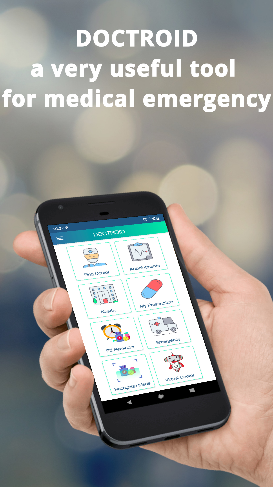
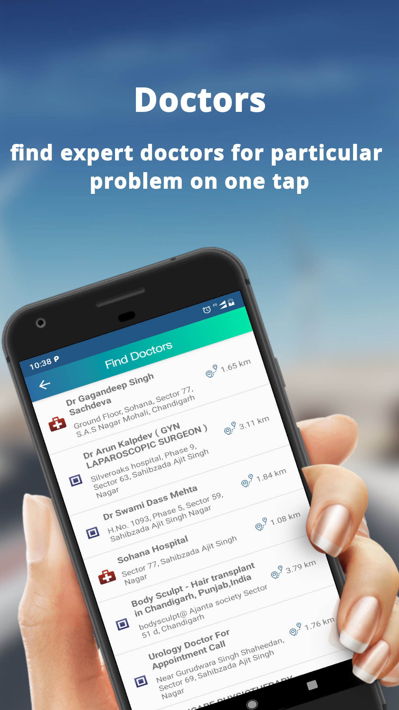

# Doctriod-Client-App
The project “Doctroid” describes the development of a real – time Android based mobile application. The project aims at launching an innovative mobile health care service supporting patients’ and health professionals’ mobility, increasing patients’ quality of life and lowering health care costs. 

The application provides features like finding nearby hospitals, doctors, pharmacies etc. Users can book appointments easily and can get prescriptions right on their screens. The application also contains an option of getting detailed medicine information. One of the core feature of app is the ability to detect car accidents, using the internal sensors of phone. The app can detect if a vehicle has crashed and can send notification to emergency contacts. One interesting feature include the virtual doctor which is basically a chat bot that ask user to input symptoms and based upon that recommend medicine to users. User can also set reminder for pills.

Following are some screenshots of the application implemented on smartphone side:

  
   

